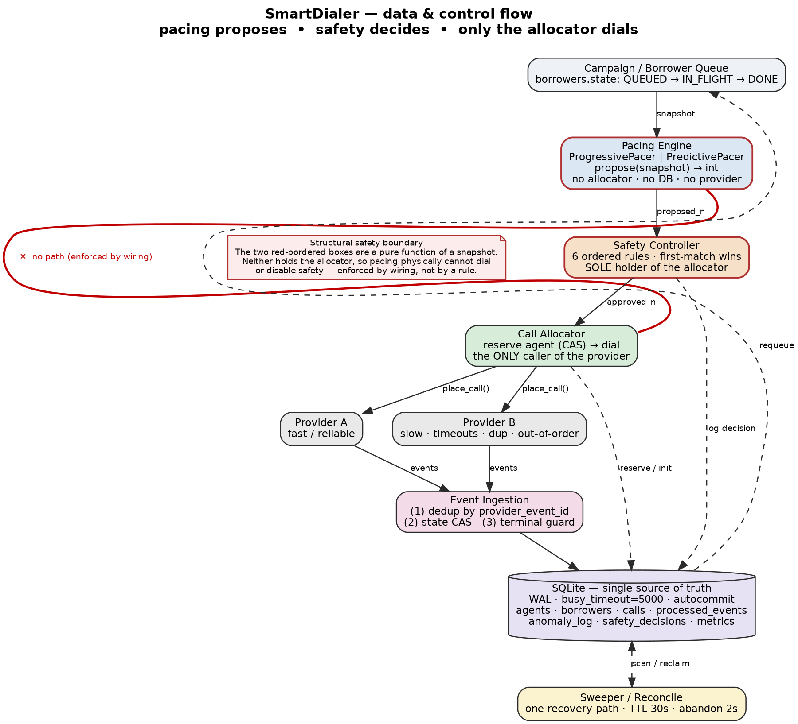

# SmartDialer

A collections auto-dialer prototype: **progressive and predictive pacing behind a
safety controller that the pacing logic can never bypass.** Python 3.10+ and
SQLite only — no external services, no third-party packages.

```bash
python3 run_tests.py && python3 simulate.py --scenario B --provider A --duration 120 --agents 100
```

The first command runs the full test suite (stdlib only, **52 tests**); the
second runs an end-to-end simulation and prints a utilisation / pacing / safety
summary.

---

## The problem

A campaign has a pool of agents and a queue of borrowers. *Progressive* dialing
places one call per free agent — safe, but agents idle between answers.
*Predictive* dialing dials ahead of demand using an estimated answer rate to
raise utilisation — but over-dial and a call gets answered with **no agent to
take it**, which is a live human hearing dead air (a compliance-relevant
*abandonment*). SmartDialer runs both pacers behind one safety controller so it
can chase predictive utilisation while keeping progressive's deterministic safety
floor, with all state in one SQLite file that many worker threads share without
double-booking an agent, double-calling a borrower, or resurrecting a finished
call.

## The key architectural idea

**Pacing proposes a number; the safety controller decides how many of those are
safe; only the allocator can dial.** The pacer is a pure function of a snapshot
and holds no reference to the allocator, provider, or database — so it
*physically cannot* place a call or turn safety off. That boundary is enforced by
the object graph (wiring), not by a convention anyone could forget.



The red edge is the load-bearing property: **there is no path from pacing to the
allocator.**

## Pipeline

```
Borrower Queue → Pacing Engine → Safety Controller → Call Allocator → Provider A/B
                 propose(int)     6 ordered rules      reserve+dial     place_call()
                                                            │                │
                                          Event Ingestion ◄─┘                │
                                          (dedup + CAS + terminal guard) ◄───┘
                                                            │
                                                         SQLite  ── Sweeper/Reconcile
                                                   (single source of truth)
```

## Key components

| Component | File | Role |
|---|---|---|
| DB / schema | `smartdialer/db.py` | Single source of truth; WAL, `busy_timeout`, autocommit |
| Agent state machine | `smartdialer/agent.py` | 7 states; atomic `try_reserve`; OFFLINE side-effects |
| Call state machine | `smartdialer/call.py` | 9 states; event ingestion (dedup + CAS + terminal guard) |
| Borrower queue | `smartdialer/borrower.py` | Atomic `claim_next`; guarded `requeue` |
| Pacing | `smartdialer/pacing.py` | Progressive + predictive `propose(snapshot) -> int` |
| Estimator | `smartdialer/estimator.py` | Rolling answer-rate estimate |
| Safety controller | `smartdialer/safety.py` | Six ordered rules; **sole holder of the allocator** |
| Allocator | `smartdialer/allocator.py` | Reserve+dial / dial-then-bridge; abandonment |
| Providers | `smartdialer/providers/` | Two mock telecoms behind one interface; health |
| Sweeper / Reconcile | `smartdialer/sweeper.py`, `reconcile.py` | One recovery path; 30s + 2s TTLs |

## The safety boundary

The `SafetyController` is the only object that holds the allocator. A pacer
receives only a snapshot and returns an int; it has no allocator, provider, or DB
handle. `admit()` runs the pacer, applies six ordered first-match-wins rules
(circuit-breaker → sudden-drop → anomaly-spike → hard-overdial-cap →
nothing-proposed → default-approve), writes a `safety_decisions` row explaining
the choice, and only then places calls. So "why did it dial N and not M?" is
answered by reading one row. Details and the full rule table: [ARCHITECTURE §11–§13](./docs/ARCHITECTURE.md#11-safety-controller).

## Progressive vs predictive

- **Progressive** (`ProgressivePacer`): one dial per free agent — reserve an agent
  *before* dialing, so every call has a landing spot. Deterministic safety, lower
  utilisation.
- **Predictive** (`PredictivePacer`): dial ahead at the estimated rate
  (`ceil((available + free_soon) / rate) − in_flight`), binding an agent at answer
  time. Higher utilisation; over-dial turns into *bounded, counted* abandonment,
  never a silent dead line — because binding is a per-agent CAS and the overdial
  cap bounds setups in every rule branch. A 40-attempt warm-up paces
  progressively until there is enough data to trust the estimate.

## Concurrency, in three lines

- **One source of truth.** All state in one SQLite file; no cache, so no
  cache-vs-DB disagreement to reconcile.
- **Compare-and-swap everywhere.** Every state change is
  `UPDATE ... WHERE state = <expected>`; `rowcount` is the win/lose signal, so two
  workers can never both act on one row.
- **One reconciler.** The sweeper handles timeouts, crashes, and (on a tight 2s
  path) the abandoned-call compliance case — no separate crash-recovery code.

Proven under real threads: 20 threads racing for one agent (exactly one wins), 8
workers on a shared DB with no double-booking. See
[ARCHITECTURE §7–§10](./docs/ARCHITECTURE.md#7-concurrency-model).

## Failure handling and recovery

Worker crash mid-flow, agent disconnect (reserved / dialing / connected), provider
outage, duplicate events, out-of-order events, predictor overestimation, and
answer-with-no-agent each have a defined protection and a deterministic recovery.
The connection is autocommit, so multi-statement operations are *not* atomic by
transaction — instead every partial state a crash can leave is recoverable by the
sweeper (30s generic TTL, 2s abandonment TTL). Full walkthrough table:
[ARCHITECTURE §20](./docs/ARCHITECTURE.md#20-failure-handling-walkthroughs).

## Provider abstraction

The dialer calls only `place_call()` and `poll_events()`, so it never depends on a
provider's internals. **Provider A** is fast/reliable; **Provider B** is
slow with timeouts, duplicate and out-of-order events — both seeded for
reproducibility. A provider that fails 5 setups in a row within 10s trips
`is_degraded`, which drives the safety controller's circuit breaker. A real
telecom (e.g. Plivo) drops in behind the same interface.

## Why SQLite (and not Postgres/Redis/Kafka)

SQLite gives ACID transactions and a genuine **atomic conditional update**
(`UPDATE ... WHERE state=?`) — which *is* the entire concurrency-safety story —
with zero setup, so the whole project runs with `python3 run_tests.py` and nothing
else. One file means one source of truth and no cache/DB consistency problem to
get wrong. The honest cost is single-writer, single-host; the migration to
Postgres is mechanical *because* every write is already a guarded CAS. ADR:
[ARCHITECTURE §23](./docs/ARCHITECTURE.md#23-adr-python--sqlite).

## Testing

```bash
python3 run_tests.py     # stdlib only, no dependencies → 52 passed, 0 failed
# or, if you have pytest installed:
pytest -q
```

Covers both state machines, real-thread concurrency + stress, the six safety
rules and their ordering, the five named failure cases, predictive/estimator
behaviour, providers + allocator, the load-test harness, and a dedicated
`tests/test_invariants.py` that pins the safety invariants directly.

## Scaling

`load_test.py --sweep` isolates the hot reserve path. The measured result: the
single-writer ceiling is real but shows up as **tail latency, not lock errors**
(`locked_rate` stays 0.0), and the reserve path is **not** the first wall at
10,000 agents — hot-row metric contention, whole-lifecycle write rate, and the
single-host limit are. Numbers and migration path: [`docs/SCALE.md`](./docs/SCALE.md)
and [ARCHITECTURE §24](./docs/ARCHITECTURE.md#24-scaling-100--1000--10000).

## Utilisation vs safety — the assignment's closing question

**Predictive pacing decides how aggressively to *propose*; it never decides how
much is *safe*.** Both pacers feed the same controller and every approved call
goes through the same per-agent reservation, so the hard overdial cap and the
per-agent CAS bound live agent-bound calls deterministically regardless of which
pacer proposed. A wrong prediction costs utilisation, not safety: overflow is
clipped by the cap and any excess answers hit the binding gate + 2s abandonment
guard; a degraded provider trips the breaker back to one-dial-per-agent. The full
12-point answer is [ARCHITECTURE §27–§28](./docs/ARCHITECTURE.md#27-the-assignments-closing-question).

## What I'd do differently

Shared (DB-backed) provider health instead of per-instance; an event-reorder
window so an out-of-order `ANSWERED`-before-`RINGING` recovers the answer instead
of dropping it (a utilisation, not safety, cost); data-calibrated safety
constants; a feed-forward term for fast rate changes; and a dedicated stale-
borrower sweep. Details: [ARCHITECTURE §29](./docs/ARCHITECTURE.md#29-what-id-do-differently--least-confident-about).

---

## Setup

No install step. Requires Python 3.10+ (standard library only).

```bash
git clone <your-repo-url> smartdialer
cd smartdialer
python3 run_tests.py
```

## Run the simulator

```bash
python3 simulate.py --scenario B --provider A --duration 180 --agents 100 --out run.csv
```

Scenarios: `A` (20% answer / 120s talk), `B` (50% / 90s), `C` (70% / 180s),
`D` (rate changes across the run). Providers: `A` (fast/reliable) or `B`
(slow/timeouts/duplicates/out-of-order). Inject failures with
`--outage-start/--outage-end` and `--drop-at/--drop-count`. The run prints a
summary and writes a per-tick CSV (proposed vs approved counts and the safety
action for every tick).

## Run the load test

```bash
python3 load_test.py --sweep --duration 3
```

Measures reserve throughput, CAS latency percentiles, and lock contention as
concurrency grows.

## Deliverable checklist

| Deliverable | Location |
|---|---|
| Working source code | `smartdialer/` |
| README + setup | this file |
| Architecture diagram | `docs/diagrams/architecture-pipeline.png` (source: `.dot`) |
| Agent state machine | `docs/diagrams/agent-state-machine.png` + `smartdialer/agent.py` |
| Call state machine | `docs/diagrams/call-state-machine.png` + `smartdialer/call.py` |
| Progressive dialer | `smartdialer/pacing.py` (ProgressivePacer) + `smartdialer/allocator.py` |
| Predictive pacing engine | `smartdialer/pacing.py` (PredictivePacer) + `smartdialer/estimator.py` |
| Safety controller | `smartdialer/safety.py` (six ordered rules, bypass-proof) |
| Mock telecom providers | `smartdialer/providers/` (A and B, different behaviour) |
| Tests (52) | `tests/`, run via `run_tests.py` |
| Simulation | `simulate.py` |
| Load test | `load_test.py` |
| Architecture + ADR | `docs/ARCHITECTURE.md`, `docs/SCALE.md` |
| Defense / discussion prep | `DEFENSE_NOTES.md` |

## Repository layout

```
smartdialer/          package: db, agent, borrower, call, snapshot, pacing,
                      estimator, safety, allocator, sweeper, reconcile, providers/
tests/                52 tests incl. test_invariants.py (stdlib runner)
docs/ARCHITECTURE.md  full architecture (30 sections)
docs/SCALE.md         measured load-test numbers
docs/diagrams/        pipeline + both state machines (.dot source + .png)
run_tests.py          python3 run_tests.py
simulate.py           end-to-end simulator
load_test.py          reserve-path load test
DEFENSE_NOTES.md      Q&A prep, every answer points at real code
```

Full detail — both state machines, all six rules, the invariant list, failure
walkthroughs, the ADR, scaling, and the closing-question answer — lives in
[`docs/ARCHITECTURE.md`](./docs/ARCHITECTURE.md).
