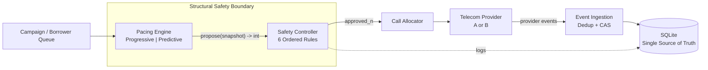
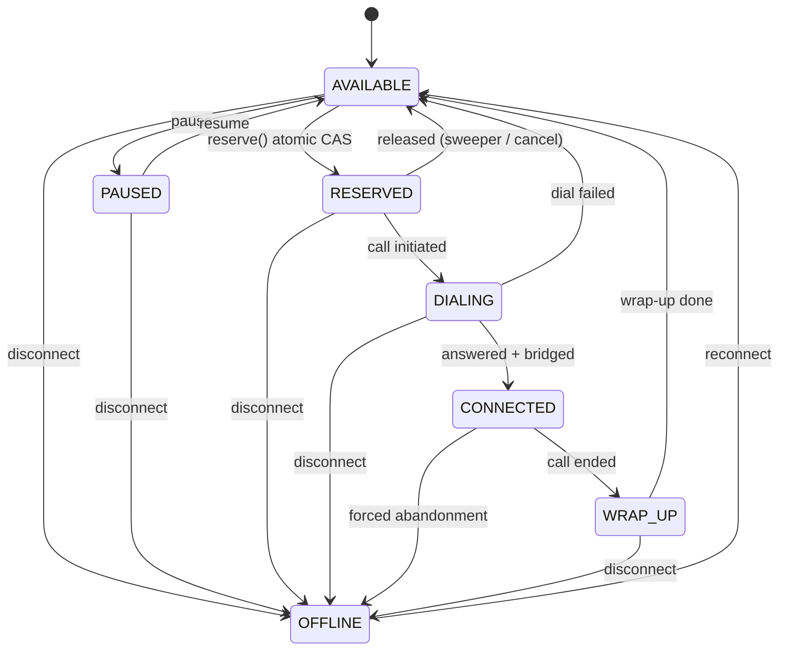
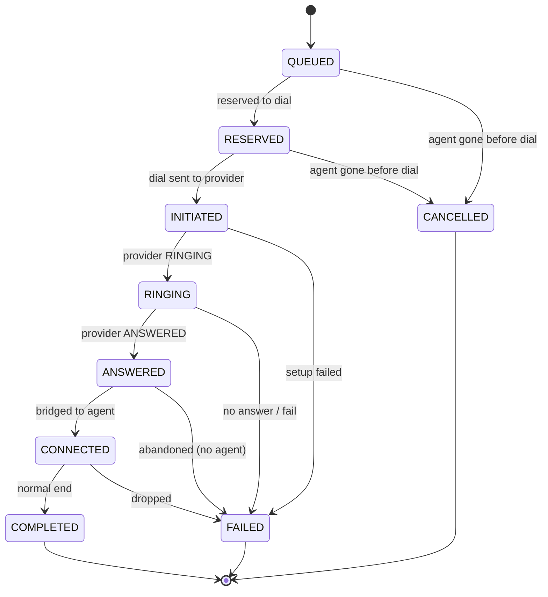

# SmartDialer

A collections auto-dialer prototype: progressive and predictive pacing behind an
independent **Safety Controller** that the pacing logic can never bypass or
switch off. Python 3.10+ and SQLite only — no Docker, no external services, no
third-party packages.
## The problem

A campaign has a pool of agents and a queue of borrowers. *Progressive* dialing
places one call per free agent — safe, but agents idle between answers.
*Predictive* dialing dials ahead of demand using an estimated answer rate to
raise utilisation — but over-dial and a call gets answered with **no agent to
take it**, which is a live human hearing dead air (a compliance-relevant
*abandonment*). SmartDialer runs both pacers behind one safety controller so it
can chase predictive utilisation while keeping progressive's deterministic safety
floor, with all state in one SQLite file that many worker threads share without
double-booking an agent, double-calling a borrower, or resurrecting a finished
call.

## The key architectural idea

**Pacing proposes a number; the safety controller decides how many of those are
safe; only the allocator can dial.** The pacer is a pure function of a snapshot
and holds no reference to the allocator, provider, or database — so it
*physically cannot* place a call or turn safety off. That boundary is enforced by
the object graph (wiring), not by a convention anyone could forget.


The red edge is the load-bearing property: **there is no path from pacing to the
allocator.**

## Pipeline

```
Borrower Queue → Pacing Engine → Safety Controller → Call Allocator → Provider A/B
                 propose(int)     6 ordered rules      reserve+dial     place_call()
                                                            │                │
                                          Event Ingestion ◄─┘                │
                                          (dedup + CAS + terminal guard) ◄───┘
                                                            │
                                                         SQLite  ── Sweeper/Reconcile
                                                   (single source of truth)
```


The pacing engine only *proposes* a number of calls — `propose(snapshot) -> int`
— and holds no reference to the allocator or the provider. The Safety
Controller is the only object that holds the allocator, and independently
decides whether a proposal is approved, reduced, rejected, or downgraded to
progressive. The allocator is the only thing that touches the provider. This is
enforced by wiring — the pacer has no path to the provider — not by a rule that
could be forgotten.



*(The pacer has no arrow to the provider or allocator by design — it can only
hand a number to the Safety Controller. Diagram source + rendered PNGs also
live in `docs/diagrams/`.)*

---

## Deliverable checklist

| Deliverable | Location |
|---|---|
| Working source code | `smartdialer/` |
| README + setup | this file |
| Architecture diagram | `docs/ARCHITECTURE.md` (mermaid) + `docs/diagrams/` (rendered) |
| Agent state machine | `docs/ARCHITECTURE.md` + `smartdialer/agent.py` |
| Call state machine | `docs/ARCHITECTURE.md` + `smartdialer/call.py` |
| Progressive dialer | `smartdialer/pacing.py` (`ProgressivePacer`) + `smartdialer/allocator.py` |
| Predictive pacing engine | `smartdialer/pacing.py` (`PredictivePacer`) + `smartdialer/estimator.py` |
| Safety controller | `smartdialer/safety.py` (six ordered rules, bypass-proof by wiring) |
| Mock telecom providers | `smartdialer/providers/` (Provider A and B, different behaviour, seeded) |
| Tests | `tests/` (10 files), run via `run_tests.py` |
| Basic simulation | `simulate.py` (virtual clock via `smartdialer/clock.py`) |
| Basic load test | `load_test.py` |
| Architecture decision doc | `docs/ARCHITECTURE.md` (ADR) + `docs/SCALE.md` |
| Defense / discussion prep | `DEFENSE_NOTES.md` |

## Requirements

- Python 3.10+ — standard library only, nothing to `pip install`.
- No Docker, no Postgres, no Redis. One SQLite file is the entire runtime
  dependency, and tests create their own temp DB.

## Setup (fresh clone)

```bash
git clone https://github.com/nikitayk/smartdialer.git
cd smartdialer
python3 run_tests.py
```

That's the whole setup — there's nothing to install and nothing to start.

## Running

```bash
python3 run_tests.py                        # full suite, stdlib only
# or, if pytest is installed:
pytest -q

# Simulate a campaign:
python3 simulate.py --scenario B --provider A --duration 180 --agents 100 --out run.csv
python3 simulate.py --scenario D --provider B --outage-start 40 --outage-end 55 --drop-at 70 --drop-count 40

# Reservation load test:
python3 load_test.py --sweep --duration 3
```

Scenarios (answer rate / mean talk seconds), straight from the assignment: `A`
20%/120s, `B` 50%/90s, `C` 70%/180s, `D` changing mid-run. Providers: `A`
(fast, reliable, ~2% setup-failure rate, in-order) or `B` (slow, ~10% timeout
probability, ~12% failure rate, duplicate *and* out-of-order events). Inject
failures with `--outage-start/--outage-end` and `--drop-at/--drop-count`. The
run prints a summary and writes a per-tick CSV (proposed vs. approved counts
and the safety action for every tick).

## Tests, mapped to the concern each one proves

| Test file | Concern it proves |
|---|---|
| `test_agent_state_machine.py` | only legal transitions are allowed; illegal ones raise; `OFFLINE` is reachable from any state and reconnect works |
| `test_call_state_machine.py` | duplicate `provider_event_id`s are idempotent; `ANSWERED x3 -> COMPLETED` and `COMPLETED -> ANSWERED -> RINGING` both land in the same consistent terminal state; terminal states are immutable |
| `test_concurrency.py` | 20 threads racing one agent -> exactly one wins; the sweeper reclaims a stale reservation and requeues it; two sweepers running at once don't double-requeue the same row; the 2s abandonment guard fires |
| `test_failure_cases.py` | the assignment's five named failure cases end-to-end: worker crash mid-flow, provider outage (call-level and provider-level), sudden agent drop (including a connected agent disconnecting mid-call), duplicate events collapsing to one transition, out-of-order terminal events never reversing |
| `test_invariants.py` | two workers claiming one borrower -> exactly one claims it; `ANSWERED` before `RINGING` is rejected, not silently applied; no terminal state can ever be left; predictive proposals never exceed the overdial cap across a sweep of answer rates; an anomaly spike is clamped to the cap, not just halved; predictive binds at most the free agents and abandons the rest honestly |
| `test_load_test.py` | the load test itself runs end-to-end and produces a report |
| `test_predictive.py` | the rolling estimator is unbiased and reacts to a rate drop; the pacer paces progressively during warm-up; the worked predictive-proposal example matches by hand; progressive never exceeds available agents |
| `test_providers_allocator.py` | providers are deterministic given a seed but behave differently from each other; a forced outage degrades a provider; the allocator reserves-then-dials in progressive mode and can dial ahead without agents in predictive mode; bridging an answer and forced abandonment both work |
| `test_safety_controller.py` | all six ordered rules individually, that the circuit breaker beats every other rule, the 35-to-12 worked example, and — structurally — that the pacer literally cannot reach the allocator |
| `test_stress.py` | many worker threads hammering one shared SQLite file at once -> no double-booking |

`conftest.py` holds shared fixtures. Everything above runs stdlib-only via
`run_tests.py`; `pytest -q` works too if it happens to be installed, but
nothing in the suite requires it.

---

# Architecture & Design

This section is also `docs/ARCHITECTURE.md`. It explains what the system does,
the decisions behind it, how it stays correct under failure, and how it scales
— written to be defended live (see `DEFENSE_NOTES.md` for the Q&A version).

## 1. Problem in one paragraph

Collections agents spend a lot of time waiting on calls that never connect,
and a dialer should close that gap without opening a bigger one: a connected
borrower with nobody there to talk to is a compliance issue, not just a bad
experience. **Progressive** dialing (one agent, one call) is safe by
construction — it never abandons — but leaves agents idle waiting for answers.
**Predictive** dialing starts calls ahead of demand to close that idle time,
at the cost of a real risk: more answers than free agents at once. The whole
design here is getting predictive's utilization upside without inheriting
that risk.

## 2. Pipeline

- **Pacing Engine** (`pacing.py`) only *proposes* a number. It's a pure
  function of a snapshot — no DB handle, no allocator reference, no provider
  reference.
- **Safety Controller** (`safety.py`) is the only component that holds the
  allocator, and independently decides how many of the proposed calls are
  actually allowed.
- **Call Allocator** (`allocator.py`) is the only component that talks to the
  provider.
- **Event Ingestion** dedups and applies provider events to SQLite, the
  single source of truth.

This is a capability chain, not a policy someone has to remember: the pacer
has no reference it could use to get around the controller, so "the
predictive algorithm can never place a call or switch safety off" is true by
wiring — `pacing.py` never imports the allocator, and `safety.py` (line 71) is
the only place in the codebase that holds a reference to it.

## 3. Key decisions (ADR)

### 3.1 Python + SQLite, nothing else

**What we chose.** Plain Python and a single SQLite file (WAL,
`busy_timeout=5000`). Workers are threads/processes sharing the one file. No
Redis, queue, ORM, or services.

**Why.** The assignment rewards the simplest architecture that's correct, and
explicitly asks for a justification of *not* reaching for heavier tools.
SQLite gives ACID transactions and a genuine atomic-`UPDATE` primitive — which
is the entire concurrency-safety story — with zero setup, so another engineer
runs the project with `python3 run_tests.py` and nothing else. Threads sharing
one file model "multiple workers on one campaign" directly.

**What it solves.** Agent/borrower double-allocation (atomic CAS), crash
recovery (the sweeper reconciling persisted rows), idempotent event handling
(a dedup table plus terminal-state guards) — all without a coordination
service.

**What it makes harder.** SQLite is single-writer and single-host. Real
multi-host worker distribution isn't possible, and under heavy write
concurrency, tail latency grows (measured in `docs/SCALE.md`). The migration
to Postgres is mechanical precisely because every write is already
`UPDATE ... WHERE`, but it's a real future step, not something V1 pretends to
have done.

### 3.2 Compare-and-swap, not a lock table

Reservation is a guarded `UPDATE`, not a read-then-write:
`UPDATE agents SET state='RESERVED', ... WHERE id=? AND state='AVAILABLE'`
(`agent.py::try_reserve`, line 52). SQLite serializes the two workers' writes:
the first gets `rowcount == 1` and wins; the second's `WHERE` clause no longer
matches, gets `rowcount == 0`, and moves on to the next candidate agent — no
separate read, no window to race in. `test_concurrency.py::test_20_threads_one_agent_exactly_one_wins`
proves it with real threads, not a thought experiment. The discipline that
makes this valid: nowhere in the system do we `SELECT` a state and `UPDATE` it
in a separate step.

### 3.3 An independent Safety Controller, not a smarter pacer

The controller doesn't trust the pacer's number — it derives its own decision
from the raw snapshot through six ordered, first-match-wins rules
(`safety.py::decide`): circuit breaker on a degraded provider, a
sudden-agent-drop guard, an anomaly-spike guard (clamped to the overdial cap,
not just halved, so it stays strictly conservative), the hard overdial cap
itself, a reject when nothing was proposed, and a default approve. Every
decision — proposed count, action, approved count, which rule fired, why — is
written to the `safety_decisions` table as an audit row, which is the literal
answer to "why did you initiate 17 calls and not 10": read the row.

### 3.4 Pure domain core

`pacing.py` and `safety.py::decide` take a snapshot in and return a value out
— no DB handle, no I/O. They're exhaustively unit-tested with no
infrastructure at all (`test_safety_controller.py`, `test_predictive.py`,
`test_invariants.py`); only the concurrency and lifecycle tests need to
actually touch SQLite.

### 3.5 A swappable clock, not a real-time-only simulator

`clock.py` is a single `now()` indirection behind `set_source()`. Production
code just uses wall-clock time; `simulate.py` swaps in a virtual clock so the
sweeper's timeout window and the 2s abandonment guard stay meaningful inside a
fast tick loop instead of being pinned to real seconds. Tests use the default
wall clock and don't need to know this exists.

## 4. State machines

Two explicit machines; illegal transitions raise rather than silently
corrupt.

**Agent.**



`OFFLINE` is a wildcard reachable from any state. Each origin state has a
distinct side effect (`reconcile.py`); the `CONNECTED` origin is the
compliance case and is force-failed and counted, never left dangling.

**Call.**



`COMPLETED` / `FAILED` / `CANCELLED` are terminal and can never be left.
Provider events are deduped by `provider_event_id` and applied by state CAS,
so duplicates and out-of-order events can't move a call incorrectly
(`call.py::apply_event`, line 103).

## 5. Reservation correctness (no double-booking)

A reservation is a guarded `UPDATE`, never a read followed by a write:

```sql
UPDATE agents SET state='RESERVED', reserved_by=?, reserved_at=?, updated_at=?
WHERE id=? AND state='AVAILABLE';
```

(`agent.py::try_reserve`, line 52.) SQLite serializes concurrent writers, so
two workers racing the same row are strictly ordered: the first commits
`AVAILABLE -> RESERVED` and its statement reports `rowcount == 1`. The
second's `WHERE state='AVAILABLE'` no longer matches anything — `rowcount ==
0` — and it learns it lost from that same statement, with no separate read
and therefore no window a second writer could exploit. The allocator
(`allocator.py::_reserve_any_agent`) just tries the next `AVAILABLE` row when
that happens.

Proven by `test_concurrency.py::test_20_threads_one_agent_exactly_one_wins`
(20 real threads, one agent, exactly one winner) and
`test_stress.py::test_multi_worker_no_double_booking` (sustained churn across
many workers, no double-book, none leaked).

## 6. The five failure cases

1. **Worker crash mid-reservation.** `agent.py::try_reserve` is one guarded
   `UPDATE`; if the worker dies before it commits, nothing was ever written —
   the agent is still `AVAILABLE`. If a worker dies *after* reserving but
   before dialing, the sweeper's TTL scan reclaims the stranded agent and
   requeues it (`sweeper.py::sweep_reservations`) — this was in fact a real
   bug caught during development (an agent stranded in `DIALING` forever) and
   fixed by routing it through `agent.py::release_to_available`. Covered by
   `test_failure_cases.py::test_case1_worker_crash_mid_flow` and
   `test_concurrency.py::test_sweeper_reclaims_stale_reservation_and_requeues`.

2. **Provider outage.** Each provider tracks its own consecutive setup
   failures (`providers/__init__.py`, `DEGRADE_FAILS = 5` within a
   `DEGRADE_WINDOW` of 10s) and exposes `is_degraded()`. The Safety
   Controller's rule 1 checks this every cycle: if the provider is degraded,
   it collapses to `FALLBACK_PROGRESSIVE` — one dial per free agent,
   regardless of what the pacer proposed — so no speculative calls go into a
   broken provider. Covered by `test_case2_provider_outage`,
   `test_case2_outage_at_provider_level`, `test_force_outage_degrades_provider`,
   and `test_rule1_circuit_breaker_fallback`.

3. **Agents suddenly drop.** Rule 2 compares `agents_available` against
   `prev_available` every cycle: if it fell by more than 25%, the controller
   **rejects** that cycle's proposal outright rather than dialing against a
   stale picture of capacity, giving the system one cycle to stabilise before
   pacing resumes. A connected agent disconnecting mid-call is handled
   separately by the agent state machine (`CONNECTED -> OFFLINE` is a forced
   abandonment, counted, never a silent hang). Covered by
   `test_case3_sudden_agent_drop_is_immediate`,
   `test_case3_connected_agent_disconnect_forces_abandonment`,
   `test_rule2_sudden_drop_reject`, and `test_rule2_moderate_drop_not_triggered`
   (proving the guard doesn't false-trigger on normal churn).

4. **Duplicate events.** Every provider event carries a `provider_event_id`;
   `call.py::apply_event` (line 103) inserts it into a dedup table first and
   rejects the event as `duplicate_event_id` if it's already been seen, so a
   redelivered event produces zero additional state transitions. Provider B
   is deliberately built to redeliver ~5% of events 1–2 extra times
   (`providers/__init__.py::_emit`) so this is exercised for real, not just
   asserted. Covered by `test_duplicate_event_id_is_idempotent` and
   `test_case4_duplicate_events_single_transition`.

5. **Out-of-order events.** `apply_event` checks the call's *current* state
   before applying an event, not just its type, so an event that doesn't
   match a legal transition from the current state is rejected
   (`out_of_order_or_wrong_state`) rather than silently applied — and once a
   call is terminal, no later event can move it at all (`event_after_terminal`
   guard). Provider B deliberately emits `ANSWERED` before `RINGING` ~8% of
   the time (`ooo_rate`) to exercise this. Covered by
   `test_completed_answered_ringing_out_of_order`, `test_terminal_is_immutable`,
   `test_answered_before_ringing_is_rejected_not_applied`, and
   `test_case5_out_of_order_terminal_never_reverses`.

## 7. Predictive pacing & the safety floor

**Progressive** (`pacing.py::ProgressivePacer`) is one line: propose
`max(agents_available - in_setup, 0)` — never more calls than free agents,
full stop.

**Predictive** (`pacing.py::PredictivePacer`) has a warm-up guard: for the
first 40 observed attempts (`WARMUP_ATTEMPTS`) it behaves exactly like the
progressive pacer, so there's no cold-start flood before the estimate means
anything. After warm-up:

```
rate   = max(predicted_answer_rate, 0.01)
target = agents_available + agents_expected_free_soon
propose = max(ceil(target / rate) - calls_in_flight, 0)
```

The answer-rate estimate itself (`estimator.py::RollingEstimator`) is a plain
rolling window over the last 200 outcomes — no confidence intervals, just a
mean — falling back to a 0.3 prior when fewer than 10 samples exist, and
clamped to `[0.02, 0.98]` so the pacer never divides by ~0. It's intentionally
simple: a plain window is unbiased and reacts within a window's worth of
calls, which at real call volume is a second or two — fast enough for a
sudden drop, not noisy tick to tick.

**The safety floor never depends on trusting that estimate.** Whatever the
pacer proposes, `safety.py::decide` runs six ordered, first-match-wins rules
over the raw snapshot and can only ever *reduce or replace* the number, never
increase it:

1. **Circuit breaker** — provider degraded -> fall back to one dial per free agent.
2. **Sudden agent-drop guard** — available dropped >25% since last cycle -> reject.
3. **Anomaly-spike guard** — too many anomalies in the last 5 minutes -> approve at most half the proposal, clamped to the overdial cap.
4. **Hard overdial cap** — `dialing + ringing` may never exceed `agents_available * 1.5` -> reduce to whatever's left under the cap.
5. **Nothing proposed** — proposal ≤ 0 -> reject.
6. **Default** — approve as proposed.

Every decision is logged to `safety_decisions` (proposed, action, approved,
rule, reason) so any run is auditable after the fact.

**Worked example** (also a passing test,
`test_safety_controller.py::test_predictive_worked_example_35_to_12` /
`test_predictive.py::test_predictive_worked_example_after_warmup`): 10 agents
available, 5 expected free soon, estimated answer rate 0.4, 3 calls already
in flight -> the pacer proposes `ceil(15 / 0.4) - 3 = 35`. The overdial cap is
`int(10 * 1.5) = 15`; with 3 already in setup, only `15 - 3 = 12` more fit
under it, so rule 4 reduces the approved count to **12**, not 35. That gap —
what the pacer wanted vs. what safety actually allowed — is exactly what the
`safety_decisions` row makes explainable.

## 8. Scaling: 100 -> 1,000 -> 10,000 agents

`load_test.py --sweep` measures the hottest write path directly (the atomic
reserve) instead of assuming where it breaks. Representative numbers (full
data in `docs/SCALE.md`):

| agents | workers | reserves/s | p99 latency |
|---|---|---|---|
| 100 | 1 | ~9,900 | 0.13 ms |
| 100 | 16 | ~13,300 | 6.5 ms |
| 1,000 | 1 | ~6,200 | 0.16 ms |
| 1,000 | 16 | ~9,200 | 8.6 ms |

Two things fall out of the data:

- **The single-writer ceiling is real but far higher than expected** — going
  from 1 to 16 workers buys ~1.4x throughput, not 16x, because every write
  serializes through one writer. But at 10,000 agents, a rough call-volume
  estimate puts reservation demand around ~300/s even with generous
  predictive over-dial — the measured ceiling of ~10,000/s is roughly 30x
  that. **The reservation path is not the first thing to break.**
- **The bottleneck shows up as p99 latency, not lock errors.** WAL +
  `busy_timeout` absorb contention into waiting (`locked_rate` is 0.0
  throughout the sweep), so the real signal is tail latency climbing, not
  `database is locked` exceptions.

What actually breaks first, in order, and the fix for each:

1. **Hot-row metric contention.** Every call bumps shared counter rows
   (`calls_initiated`, `calls_connected`, `forced_abandonment`). Fix: shard
   the counters per worker and sum periodically. Cheap, and the first thing
   to change.
2. **Whole-lifecycle write volume.** Each call is ~6–8 writes across its
   life, not just one reservation; at 10k agents that's a few thousand
   writes/sec through the single writer.
3. **Sweeper scan cost.** Indexed today (`state`/`reserved_at`/`updated_at`),
   cheap into the low thousands; needs a bounded scan (only rows past TTL) at
   higher volume.
4. **Single host.** SQLite is one file on one machine — a hard ceiling
   independent of any benchmark, and the real reason to eventually move.

Migration path: shard the metric counters first (cheap, immediate). When one
host genuinely isn't enough, move to Postgres — the CAS pattern
(`UPDATE ... WHERE state = ...`) ports directly since the whole design was
built on it, so this move is mechanical rather than a rewrite. Beyond a single
Postgres writer, partition by campaign, since a campaign's agents/calls are
already independent of every other campaign's. "Add more servers" was never
the answer on its own — the single writer, hot-row contention, and the
single-host limit are the actual walls, and each has a specific, measured fix.

## 9. The assignment's closing question

**How would you build a SmartDialer that gets as much of the utilization
benefit of predictive dialing as possible, while retaining the deterministic
safety characteristics of progressive dialing?**

Both pacers feed the *same* Safety Controller, and every approved call is
placed through the *same* per-agent atomic reservation regardless of which
pacer proposed it. Progressive safety isn't a mode you switch into — it's the
floor the predictive path always stands on. The hard overdial cap and the
per-agent CAS mean the number of live agent-bound calls is deterministically
bounded whether pacing is progressive or predictive.

Predictive only ever changes *how many setups we attempt ahead of demand*; it
can never change *how many answered calls can bind an agent*, because that's
gated by the reservation itself (`allocator.py::bridge_answered`), not by the
pacer. When the estimate is wrong or the provider degrades, the controller
collapses to one dial per free agent (`circuit_breaker`), and any answer that
still beats the agent pool hits the 2s abandonment guard rather than a silent
dead line.

So the utilization upside is bounded by a deterministic safety floor that does
not depend on trusting the predictor.

## 10. What I'd do differently / least confident about

- **Provider health is per-process, not shared.** `is_degraded()` lives inside
  each provider instance as in-memory consecutive-failure state. That's
  correct for the single-process simulator, but with real workers on separate
  connections or hosts, each would only see its own failures — the breaker
  could be slow to trip globally. The fix is a shared health record in the
  DB that every worker updates and reads; I scoped it to in-provider for V1
  and am calling it out rather than hiding it.
- **The 1.5x overdial ratio is a reasonable default, not a calibrated one.**
  `MAX_OVERDIAL_RATIO` is a named constant, not fitted to historical
  abandonment data. A real deployment would tune it from observed outcomes.
- **The estimator has no feed-forward term.** A rolling window reacts within
  a window's worth of calls; on `--scenario D` with a flaky provider, a rate
  change that's faster than the window adapts can produce a short
  abandonment spike before the estimate and the safety cap catch up. A
  short-term derivative term on the estimator would tighten that.
- **With another week:** move provider health into the DB, shard the metric
  counters (the first real scale fix per section 8), add that feed-forward
  term, and wire in a real Plivo integration behind the existing provider
  interface — it was built as a drop-in interface specifically so that's not
  a rewrite.

---

## Layout

```
smartdialer/
  __init__.py
  agent.py           agent state machine; atomic reserve (try_reserve, line 52)
  call.py            call state machine; provider-event ingestion (apply_event, line 103)
  borrower.py        borrower queue; atomic claim
  sweeper.py         reconcile timeouts, crashes, abandonment (sweep_abandoned, line 78)
  reconcile.py        agent-offline side effects
  pacing.py           ProgressivePacer + PredictivePacer (pure: propose(snapshot) -> int)
  estimator.py        rolling answer-rate estimate
  safety.py           six ordered rules; sole holder of the allocator reference
  allocator.py         places calls, bridges answers, handles abandonment
  snapshot.py          read-only state view for pacer + safety
  db.py                 schema; the single source of truth
  clock.py              swappable "now" — real wall clock, or virtual for the simulator
  providers/
    __init__.py         TelecomProvider interface + mock Provider A / Provider B

tests/
  conftest.py
  test_agent_state_machine.py
  test_call_state_machine.py
  test_concurrency.py
  test_failure_cases.py
  test_invariants.py
  test_load_test.py
  test_predictive.py
  test_providers_allocator.py
  test_safety_controller.py
  test_stress.py

docs/
  ARCHITECTURE.md      this document
  SCALE.md              full load-test data + scaling analysis
  diagrams/              rendered .dot / .png versions of the diagrams above

run_tests.py        simulate.py        load_test.py        DEFENSE_NOTES.md
```
