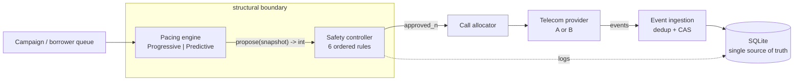
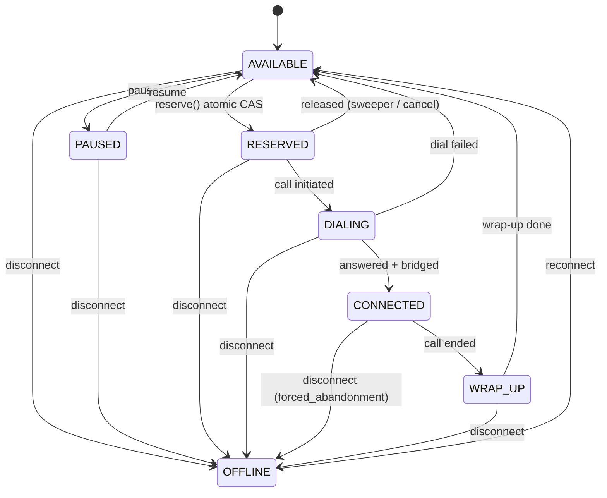
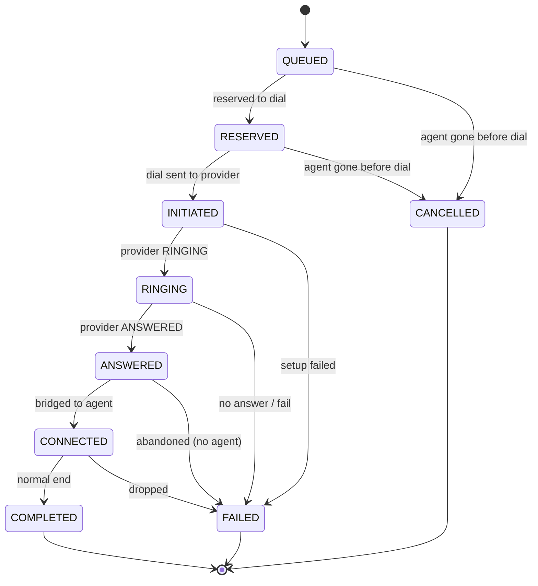

# Architecture

## Pipeline

The dialer is a single line of responsibility. The pacing engine only *proposes*
a number; the safety controller *decides*; only the allocator touches the
provider. Nothing upstream of the safety controller can place a call.

The pacing engine is a pure function of a snapshot and holds no reference to the
allocator (`smartdialer/pacing.py`). The safety controller is the only object
that holds the allocator (`smartdialer/safety.py`, line 71). So "the predictive
algorithm can never place a call or switch safety off" is enforced by wiring,
not by a rule that could be forgotten.

## Components

| Component | File | Responsibility |
|---|---|---|
| Agent state machine | `smartdialer/agent.py` | Agent lifecycle; atomic reserve |
| Call state machine | `smartdialer/call.py` | Call lifecycle; provider-event ingestion |
| Borrower queue | `smartdialer/borrower.py` | Which borrower to call; atomic claim |
| Sweeper | `smartdialer/sweeper.py` | Reconcile timeouts, crashes, abandonment |
| Reconcile | `smartdialer/reconcile.py` | Agent-offline side effects |
| Pacing | `smartdialer/pacing.py` | Progressive + predictive proposals |
| Estimator | `smartdialer/estimator.py` | Rolling answer-rate estimate |
| Safety controller | `smartdialer/safety.py` | Six ordered rules; sole allocator holder |
| Allocator | `smartdialer/allocator.py` | Place calls; bridge answers; abandonment |
| Providers | `smartdialer/providers/` | Two mock telecoms behind one interface |
| Snapshot | `smartdialer/snapshot.py` | Read-only state view for pacer + safety |
| DB | `smartdialer/db.py` | Schema; the single source of truth |

## Agent state machine

OFFLINE is a wildcard reachable from any state. Each origin state has a distinct
side effect (`smartdialer/reconcile.py`); the CONNECTED origin is the compliance
case and is force-failed and counted, never left dangling.

## Call state machine

COMPLETED / FAILED / CANCELLED are terminal and can never be left. Provider
events are deduped by `provider_event_id` and applied by state CAS, so
duplicates and out-of-order events cannot move a call incorrectly
(`smartdialer/call.py`, `apply_event`, line 103).

## Concurrency model

- **One source of truth.** All state is in one SQLite file; there is no cache,
  so there is no cache-vs-DB disagreement.
- **Compare-and-swap everywhere.** Every state change is
  `UPDATE ... WHERE state = <expected>`. No path reads a state then writes it in
  a separate step, so two workers can't both act on one row.
- **One reconciler.** The sweeper handles timeouts, worker crashes, and (on a
  tight 2s path) abandonment. There is no separate crash-recovery code.

## ADR: Python + SQLite

**What we chose.** Plain Python and a single SQLite file (WAL,
`busy_timeout=5000`). Workers are threads/processes sharing the one file. No
Redis, queue, ORM, or services.

**Why.** The assignment rewards the simplest architecture that is correct, and
explicitly asks you to justify not reaching for heavier tools. SQLite gives ACID
transactions and a genuine atomic-`UPDATE` primitive — which is the entire
concurrency-safety story — with zero setup, so another engineer runs the project
with `python3 run_tests.py` and nothing else. Threads sharing one file model
"multiple workers on one campaign" directly.

**What it solves.** Agent/borrower double-allocation (atomic CAS), crash
recovery (sweeper over persisted rows), idempotent event handling (a dedup table
plus terminal-state guards) — all without a coordination service.

**What it makes harder.** SQLite is single-writer and single-host. Real
multi-host worker distribution isn't possible, and under heavy write concurrency
tail latency grows (see `docs/SCALE.md` for the measured numbers). The migration
to Postgres is mechanical precisely because every write is already a
`UPDATE ... WHERE`, but it is a real future step, not something V1 pretends to do.

## Evaluation-criteria mapping

| Criteria (weight) | Where |
|---|---|
| System design (20%) | This doc; pipeline + `safety.py` boundary |
| Distributed systems & concurrency (15%) | `agent.py` CAS, `sweeper.py`, `tests/test_concurrency.py`, `tests/test_stress.py` |
| Progressive dialing (10%) | `pacing.py` ProgressivePacer, `allocator.py` reserve-then-dial |
| Predictive pacing (15%) | `pacing.py` PredictivePacer, `estimator.py`, `simulate.py` |
| Safety & correctness (15%) | `safety.py`, `call.py` terminal guards, `tests/test_safety_controller.py` |
| Failure handling (10%) | `tests/test_failure_cases.py`, `reconcile.py`, `sweeper.py` |
| Testing & performance (10%) | `tests/`, `load_test.py`, `docs/SCALE.md` |
| Code quality & docs (5%) | this doc, `README.md`, `DEFENSE_NOTES.md` |

## Closing question: predictive utilization with progressive safety

Both pacers feed the *same* safety controller, and every approved call is placed
through the *same* per-agent atomic reservation regardless of which pacer
proposed it. Progressive safety is not a mode you switch into — it is the floor
the predictive path always stands on: the hard overdial cap and the per-agent CAS
mean the number of live agent-bound calls is deterministically bounded whether
pacing is progressive or predictive. Predictive only ever changes *how many
setups we attempt ahead of demand*; it can never change *how many answered calls
can bind an agent*, because that is gated by the reservation, not the pacer. When
the estimate is wrong or the provider degrades, the controller collapses to one
dial per free agent (`circuit_breaker`), and any answer that still beats the
agent pool hits the 2s abandonment guard rather than a silent dead line. So the
utilization upside is bounded by a deterministic safety floor that does not
depend on trusting the predictor.
