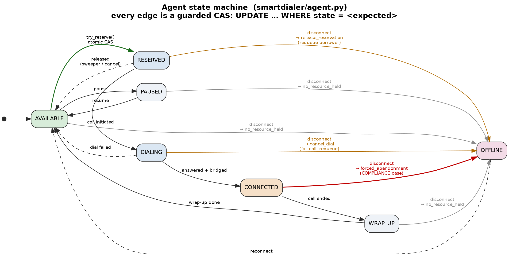
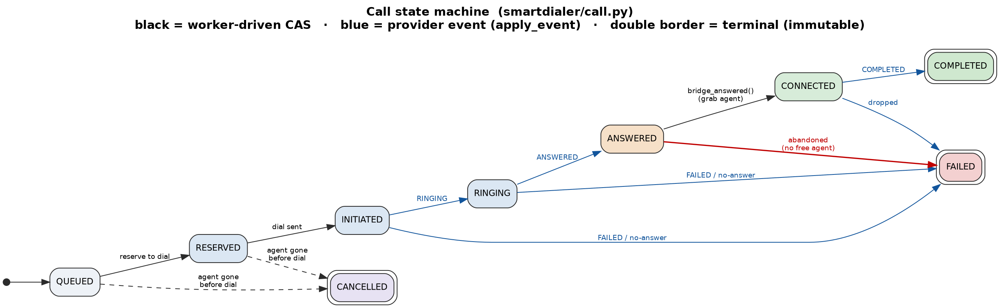

# SmartDialer — Architecture

> The one-sentence version: **pacing proposes a number, the safety controller
> decides how many of those are safe, and only the allocator can dial — a
> boundary enforced by wiring, not by a rule anyone could forget.**

---

## Table of contents

1. [Problem](#1-problem)
2. [Pipeline](#2-pipeline)
3. [Architecture diagram](#3-architecture-diagram)
4. [Component responsibilities](#4-component-responsibilities)
5. [Agent state machine](#5-agent-state-machine)
6. [Call state machine](#6-call-state-machine)
7. [Concurrency model](#7-concurrency-model)
8. [CAS correctness](#8-cas-correctness)
9. [Transaction boundaries](#9-transaction-boundaries)
10. [Reservation correctness (reserve-then-dial)](#10-reservation-correctness-reserve-then-dial)
11. [Safety Controller](#11-safety-controller)
12. [The six ordered safety rules](#12-the-six-ordered-safety-rules)
13. [Safety invariants](#13-safety-invariants)
14. [Progressive pacing](#14-progressive-pacing)
15. [Predictive pacing](#15-predictive-pacing)
16. [Estimator](#16-estimator)
17. [Predictive safety guarantee](#17-predictive-safety-guarantee)
18. [Provider abstraction](#18-provider-abstraction)
19. [Provider failover and health](#19-provider-failover-and-health)
20. [Failure handling walkthroughs](#20-failure-handling-walkthroughs)
21. [Sweeper vs Reconcile](#21-sweeper-vs-reconcile)
22. [Event idempotency and ordering](#22-event-idempotency-and-ordering)
23. [ADR: Python + SQLite](#23-adr-python--sqlite)
24. [Scaling: 100 → 1,000 → 10,000](#24-scaling-100--1000--10000)
25. [Testing and correctness](#25-testing-and-correctness)
26. [Evaluation-criteria mapping](#26-evaluation-criteria-mapping)
27. [The assignment's closing question](#27-the-assignments-closing-question)
28. [Answer to the closing question](#28-answer-to-the-closing-question)
29. [What I'd do differently / least confident about](#29-what-id-do-differently--least-confident-about)
30. [Repository layout](#30-repository-layout)

---

## 1. Problem

A collections campaign has a pool of agents and a queue of borrowers to call. A
**progressive** dialer places one call per free agent — safe, but agents sit idle
waiting for the next answer. A **predictive** dialer dials *ahead* of demand
using an estimated answer rate to raise utilisation — but if it dials too
aggressively, calls get answered with no agent to take them, which is a live
human hearing dead air (a compliance-relevant **abandonment**). SmartDialer
implements both pacers behind a single safety controller so it can chase
predictive utilisation while keeping progressive's deterministic safety floor,
with everything persisted in one SQLite file so multiple worker threads can
share state without double-booking an agent, double-calling a borrower, or
resurrecting a finished call.

## 2. Pipeline

The dialer is a single line of responsibility. Each stage does exactly one job
and hands a plain value to the next:

```
Campaign / Borrower Queue
        │  snapshot (read-only view of current state)
        ▼
Pacing Engine            propose(snapshot) -> int          (Progressive | Predictive)
        │  proposed_n
        ▼
Safety Controller        six ordered rules, first-match wins
        │  approved_n  (+ a row written to safety_decisions explaining why)
        ▼
Call Allocator           reserve agent (CAS) -> dial       (the ONLY caller of the provider)
        │
        ▼
Provider A / Provider B  place_call() / poll_events()
        │  provider events
        ▼
Event Ingestion          (1) dedup by id  (2) state CAS  (3) terminal guard
        │
        ▼
SQLite                   single source of truth (WAL, busy_timeout, autocommit)
```

The pacing engine is a **pure function of a snapshot** (`smartdialer/pacing.py`)
and holds no reference to the allocator, the provider, or the database. The
safety controller (`smartdialer/safety.py`) is the **only** object that holds the
allocator. So "the predictive algorithm can never place a call or switch safety
off" is a structural property of the object graph, not a convention.

## 3. Architecture diagram


The red edge is the load-bearing design property: **there is no path from pacing
to the allocator.** A pacer can only return an integer; the controller is the
sole component that can turn an integer into dials.

<details><summary>Diagram source (Graphviz)</summary>

Sources for all three diagrams live next to the PNGs and regenerate with
`dot -Tpng -Gdpi=150 <file>.dot -o <file>.png`:

- `docs/diagrams/architecture-pipeline.dot`
- `docs/diagrams/agent-state-machine.dot`
- `docs/diagrams/call-state-machine.dot`
</details>

## 4. Component responsibilities

| Component | File | Responsibility |
|---|---|---|
| DB / schema | `smartdialer/db.py` | The single source of truth; WAL + `busy_timeout`; all seven tables |
| Clock | `smartdialer/clock.py` | Swappable `now()` so the simulator can drive TTLs on a virtual clock |
| Agent state machine | `smartdialer/agent.py` | Agent lifecycle; atomic `try_reserve`; OFFLINE wildcard with side-effect tags |
| Borrower queue | `smartdialer/borrower.py` | Which borrower to call; atomic `claim_next`; guarded `requeue` |
| Call state machine | `smartdialer/call.py` | Call lifecycle; provider-event ingestion; dedup + CAS + terminal guard |
| Snapshot | `smartdialer/snapshot.py` | Read-only view of state for the pacer and controller |
| Pacing | `smartdialer/pacing.py` | `ProgressivePacer`, `PredictivePacer`; `propose(snapshot) -> int` only |
| Estimator | `smartdialer/estimator.py` | Rolling answer-rate estimate feeding the predictive pacer |
| Safety controller | `smartdialer/safety.py` | Six ordered rules; sole holder of the allocator; logs every decision |
| Allocator | `smartdialer/allocator.py` | Reserve + dial (progressive) or dial-then-bridge (predictive); abandonment |
| Providers | `smartdialer/providers/` | Two mock telecoms behind one interface; per-provider health |
| Sweeper | `smartdialer/sweeper.py` | One reconciliation path: stale reservations, stale calls, 2s abandonment |
| Reconcile | `smartdialer/reconcile.py` | Agent-offline side effects (release / cancel / forced abandonment) |

## 5. Agent state machine

Seven states (`smartdialer/agent.py`). Every edge is a guarded compare-and-swap;
`OFFLINE` is a wildcard reachable from any non-offline state, and each origin
carries a distinct side effect returned as a tag by `go_offline`.



| From | To | Trigger | Notes |
|---|---|---|---|
| AVAILABLE | RESERVED | `try_reserve` | The one atomic reserve; `AVAILABLE` is the CAS guard |
| RESERVED | DIALING | call initiated | Agent now committed to a specific call |
| RESERVED | AVAILABLE | released | Sweeper reclaim or a cancelled dial |
| DIALING | CONNECTED | answered + bridged | Live conversation begins |
| DIALING | AVAILABLE | dial failed | Setup failed; agent freed |
| CONNECTED | WRAP_UP | call ended | Post-call work |
| WRAP_UP | AVAILABLE | wrap-up done | Back in the pool |
| AVAILABLE | PAUSED / PAUSED → AVAILABLE | pause / resume | Break handling |
| *any non-offline* | OFFLINE | disconnect | Side effect depends on origin (below) |
| OFFLINE | AVAILABLE | reconnect | |

`go_offline` return tags and their meaning:

| Origin state | Tag | Consequence (in `reconcile.py`) |
|---|---|---|
| AVAILABLE / PAUSED / WRAP_UP | `no_resource_held` | Clean drop; nothing to reclaim |
| RESERVED | `release_reservation` | Fail the reserved call, requeue the borrower |
| DIALING | `cancel_dial` | Fail the in-setup call, requeue the borrower |
| CONNECTED | `forced_abandonment` | **The compliance case** — force-fail the live call, count it |

## 6. Call state machine

Nine states, three terminal (`COMPLETED`, `FAILED`, `CANCELLED`). Worker-driven
edges use `internal_transition`; provider-event edges arrive through
`apply_event`.



| From | To | Driver | Trigger |
|---|---|---|---|
| QUEUED | RESERVED | worker | reserved to dial |
| RESERVED | INITIATED | worker | dial sent to provider |
| INITIATED | RINGING | provider event | `RINGING` |
| RINGING | ANSWERED | provider event | `ANSWERED` |
| ANSWERED | CONNECTED | worker | `bridge_answered` grabs an agent |
| CONNECTED | COMPLETED | provider event | `COMPLETED` |
| INITIATED / RINGING / ANSWERED / CONNECTED | FAILED | provider event or force | setup fail, no-answer, abandonment, drop |
| QUEUED / RESERVED | CANCELLED | worker | agent gone before dial |

Terminal states are never the *from* side of any transition, so once a call is
`COMPLETED` / `FAILED` / `CANCELLED`, no later event can move it.

## 7. Concurrency model

Three principles, and nothing else:

1. **One source of truth.** All state is in one SQLite file
   (`smartdialer/db.py`). There is deliberately **no cache**, so there is no
   cache-vs-DB disagreement to reconcile — the classic "DB says AVAILABLE but
   cache says RESERVED, which wins?" question has no answer to get wrong because
   there is no second copy.
2. **Compare-and-swap everywhere.** Every state change is
   `UPDATE ... SET state=<new> WHERE id=? AND state=<expected>`. No code path
   reads a state and then writes it in a separate step, so two workers can never
   both act on one row. `rowcount` is the win/lose signal.
3. **One reconciler.** The sweeper handles timeouts, worker crashes, and (on a
   tight 2s path) abandonment. There is no second crash-recovery code path that
   could disagree with it.

Workers are threads/processes sharing the one file. WAL lets readers proceed
without blocking the single writer; `busy_timeout=5000` makes a colliding writer
wait-and-retry inside SQLite instead of immediately raising `database is locked`.

## 8. CAS correctness

The whole concurrency-safety story is one statement, in `agent.try_reserve`:

```sql
UPDATE agents SET state='RESERVED', reserved_by=?, reserved_at=?, updated_at=?
WHERE id=? AND state='AVAILABLE'
```

Two workers can run this on the same row at the same instant. SQLite serialises
the two writes. The first flips `AVAILABLE → RESERVED` and gets `rowcount == 1`.
The second's `WHERE state='AVAILABLE'` no longer matches, gets `rowcount == 0`,
and learns it lost **from that same statement** — no separate read, no window
between check and act. This is proven under real threads in
`tests/test_concurrency.py::test_20_threads_one_agent_exactly_one_wins` (exactly
one of 20 wins) and `tests/test_invariants.py::test_two_workers_one_borrower_exactly_one_claims`.

The same discipline covers borrower claiming, every call transition, and every
sweeper reclaim. `borrower.claim_next` reads a candidate id then CAS-claims it;
if it lost the race the `UPDATE` matches 0 rows and it simply tries the next
candidate — the read is never trusted, the guarded `UPDATE` is.

## 9. Transaction boundaries

The connection is opened with `isolation_level=None` — **autocommit**. There are
no explicit transactions anywhere in the system; every `execute` is its own
atomic, self-committing statement. This is a deliberate choice, and it shapes
what "atomic" means here:

- **Atomic:** each single guarded `UPDATE`/`INSERT`. That is the unit that makes
  a reservation, a claim, or a state transition indivisible.
- **Not atomic:** multi-statement operations like `allocator.place` (reserve
  agent → claim borrower → create call → INITIATED → agent DIALING → dial). These
  are *sequences* of independent atomic statements.

Because the multi-statement sequences are not wrapped in a transaction, the
correctness argument is not "they are atomic" — it is that **every partial state
a crash can leave is recoverable by the sweeper.** Concretely, if the process
dies between the steps of `place`:

| Crash point | Left-behind state | Reclaimed by |
|---|---|---|
| after reserve agent, before claim borrower | agent RESERVED, no call | `sweep_reservations` (30s) → AVAILABLE |
| after claim borrower, before create call | borrower IN_FLIGHT, no call | `sweep_stale_calls` won't see it, but the borrower's `locked_at` ages and a reservation sweep frees the agent; the borrower is re-driven once requeued by a stale-call sweep of any later call, or stays IN_FLIGHT until a future sweep pass — see limitation note in §29 |
| after create call (QUEUED/RESERVED/INITIATED), before events | call in a pre-answer state, agent DIALING | `sweep_stale_calls` (30s) → call FAILED, borrower requeued, **agent released** |
| after ANSWERED, before bridge | call ANSWERED, no agent | `sweep_abandoned` (2s) → FAILED + `forced_abandonment` |

This is why there is exactly one recovery mechanism and why its two TTLs (30s
generic, 2s abandonment) are different: a reserved-but-idle resource can wait
30s; a live human on an answered-but-unconnected line cannot.

## 10. Reservation correctness (reserve-then-dial)

The assignment's hard cases, and the deterministic outcome for each. The common
recovery mechanism is always the sweeper/reconciler — there is no competing path.

| Case | Scenario | Protection | Deterministic outcome |
|---|---|---|---|
| A | agent reserved → process crashes before dialing | `reserved_at` ages past `RESERVED_TTL` | `sweep_reservations` → agent AVAILABLE |
| B | agent reserved → agent disconnects before dialing | `reconcile.agent_offline` sees `release_reservation` | call force-failed, borrower requeued, agent OFFLINE |
| C | agent reserved → provider dial fails | provider emits `FAILED`; `apply_event`/simulator frees agent | call FAILED, agent released to AVAILABLE, borrower requeued via sweep |
| D | agent reserved → dial succeeds → agent disconnects | `reconcile.agent_offline` on CONNECTED → `forced_abandonment` | call force-failed, counted; on DIALING → `cancel_dial` |
| E | two workers reserve the same agent simultaneously | `try_reserve` CAS on `state='AVAILABLE'` | exactly one wins (`rowcount==1`), the other moves on |
| F | borrower claimed by two workers simultaneously | `claim_next` CAS on `state='QUEUED'` | exactly one wins, the other picks another candidate |
| G | reservation becomes stale | `reserved_at < now - RESERVED_TTL` | `sweep_reservations` reclaims; guarded so only one sweeper acts |

## 11. Safety Controller

`smartdialer/safety.py`. Two properties matter:

1. **It is the only holder of the allocator.** `SafetyController.__init__` takes
   `(conn, allocator)` and keeps the allocator as a private field. The pacer
   never receives it. That is the structural boundary.
2. **Its decision is a pure, ordered, logged function.** `decide(proposed, snap)`
   has no side effects and is trivially unit-testable. `admit(pacer, snap)` runs
   `pacer.propose(snap)`, calls `decide`, writes a `safety_decisions` row
   (`proposed_n`, `action`, `approved_n`, `rule_triggered`, `reason`), and only
   then — if `approved_n > 0` — calls `allocator.place(...)`. Every decision is
   auditable after the fact by reading one row.

`admit` also chooses the placement mode: it reserves agents up front
(progressive) when the pacer's `mode` is `"progressive"` **or** when the safety
action is `FALLBACK_PROGRESSIVE`; otherwise it dials without reserving
(predictive) and binds agents at answer time.

## 12. The six ordered safety rules

`decide()` evaluates six rules in order; the **first match wins** and returns.
Inputs are read from the snapshot; each rule either rejects, reduces, falls back,
or approves, and the result (`approved_n`) is what the allocator receives.

```
proposed_n (from pacer)
      │
      ▼
Rule 1  circuit_breaker      provider_degraded?            → FALLBACK_PROGRESSIVE, n = clamp(proposed, 0, avail)
      │ (no)
      ▼
Rule 2  sudden_agent_drop    avail < prev * (1 - 0.25)?    → REJECT, n = 0
      │ (no)
      ▼
Rule 3  anomaly_spike        anomalies_5min > 20?          → REDUCE, n = min(proposed // 2, cap - in_setup)
      │ (no)
      ▼
Rule 4  hard_overdial_cap    in_setup + proposed > cap?    → REDUCE, n = max(cap - in_setup, 0)
      │ (no)
      ▼
Rule 5  nothing_proposed     proposed <= 0?                → REJECT, n = 0
      │ (no)
      ▼
Rule 6  default_approve                                    → APPROVE, n = proposed
      │
      ▼
approved_n → Allocator
```

Where `avail = agents_available`, `in_setup = calls_dialing + calls_ringing`, and
`cap = int(avail * MAX_OVERDIAL_RATIO)` with `MAX_OVERDIAL_RATIO = 1.5`. Other
constants: `SUDDEN_DROP_RATIO = 0.25`, `ANOMALY_WINDOW_LIMIT = 20` (anomalies in
the last 5 minutes).

| # | Rule | Fires when | Action | `approved_n` | Passed on |
|---|---|---|---|---|---|
| 1 | `circuit_breaker` | provider degraded | FALLBACK_PROGRESSIVE | `clamp(proposed, 0, avail)` | one dial per free agent |
| 2 | `sudden_agent_drop` | `avail < prev·0.75` (prev>0) | REJECT | `0` | nothing this cycle |
| 3 | `anomaly_spike` | `anomalies_5min > 20` | REDUCE | `min(proposed//2, cap−in_setup)` | halved **and** capped |
| 4 | `hard_overdial_cap` | `in_setup + proposed > cap` | REDUCE | `max(cap − in_setup, 0)` | fill to the cap |
| 5 | `nothing_proposed` | `proposed ≤ 0` | REJECT | `0` | nothing |
| 6 | `default_approve` | otherwise | APPROVE | `proposed` | as proposed |

> **Rule 3 note (a real fix, not the original code).** Rules are first-match-wins,
> so a match at rule 3 short-circuits rule 4. Halving a *huge* predictive proposal
> (which happens when the estimated answer rate is low) is still huge, so the
> original `proposed // 2` could approve more setups than the overdial cap allows —
> the anomaly guard, meant to be conservative, could breach the envelope it exists
> to protect. Rule 3 now clamps to `cap − in_setup` as well, so it can only ever be
> *more* conservative. This makes invariant #10 hold in **every** branch. Measured
> effect on a flaky-provider stress run (`--scenario D --provider B`, seeded):
> forced abandonments dropped from 163 → 38. Regression:
> `tests/test_invariants.py::test_anomaly_spike_clamped_to_cap_regression`, and the
> across-the-board property test `::test_predictive_never_exceeds_overdial_cap_across_rates`.

## 13. Safety invariants

Each of these is guaranteed by the implementation and pinned by a test.

1. **One agent cannot have multiple active reservations.** `try_reserve` CAS on
   `state='AVAILABLE'`. → `test_20_threads_one_agent_exactly_one_wins`.
2. **One borrower cannot have multiple active claims.** `claim_next` CAS on
   `state='QUEUED'`. → `test_two_workers_one_borrower_exactly_one_claims`.
3. **Terminal calls cannot transition back to active states.** Terminal is never
   a *from* state; `apply_event` guards it explicitly. → `test_no_terminal_state_can_be_left`,
   `test_terminal_is_immutable`.
4. **Pacing cannot directly place a call.** A pacer returns an int and holds no
   allocator/provider/DB handle. → `test_pacer_cannot_reach_allocator_structural`.
5. **Pacing cannot access the allocator.** The controller is the sole holder;
   verified by attribute-absence and `propose` arity. → same test.
6. **Only SafetyController authorises call placement.** `admit` is the only path
   that calls `allocator.place`. → `test_controller_admits_and_logs`.
7. **Provider events are idempotent.** `INSERT OR IGNORE` into `processed_events`
   by `provider_event_id`. → `test_duplicate_event_id_is_idempotent`,
   `test_case4_duplicate_events_single_transition`.
8. **Out-of-order events cannot move calls incorrectly.** State CAS rejects any
   event that doesn't fit the current state; illegal jumps never happen. →
   `test_answered_before_ringing_is_rejected_not_applied`,
   `test_case5_out_of_order_terminal_never_reverses`.
9. **An answered call with no agent is explicitly handled.** `bridge_answered`
   grabs an agent or force-fails + counts `forced_abandonment`; the 2s sweep is
   the backstop. → `test_bridge_answered_and_abandonment`, `test_fast_abandon_guard`.
10. **Predictive pacing cannot increase the safety-approved capacity.** The cap
    bounds `in_setup + approved_n ≤ cap` in every rule branch (rule 3 now
    clamped). → `test_predictive_never_exceeds_overdial_cap_across_rates`.
11. **Agent disconnects cannot permanently strand active reservations.**
    `reconcile.agent_offline` applies the correct side effect; the sweeper frees
    anything missed. → `test_case1_worker_crash_mid_flow`,
    `test_case3_connected_agent_disconnect_forces_abandonment`.
12. **Provider degradation causes conservative behaviour.** The circuit breaker
    collapses to one dial per free agent. → `test_rule1_circuit_breaker_fallback`,
    `test_case2_provider_outage`.

## 14. Progressive pacing

`ProgressivePacer.propose` (`mode = "progressive"`):

```
in_setup = calls_dialing + calls_ringing
return max(agents_available - in_setup, 0)
```

One dial per free agent, minus what is already in setup so we never double-count.
It is not a stub: it is also the exact behaviour the safety controller collapses
to under `FALLBACK_PROGRESSIVE`. → `test_progressive_never_exceeds_available`.

## 15. Predictive pacing

`PredictivePacer.propose` (`mode = "predictive"`, `WARMUP_ATTEMPTS = 40`):

```
in_setup = calls_dialing + calls_ringing
if observed_attempts < WARMUP_ATTEMPTS:
    return max(agents_available - in_setup, 0)          # cold start: behave progressively
rate   = max(predicted_answer_rate, 0.01)
target = agents_available + agents_expected_free_soon
raw    = ceil(target / rate) - calls_in_flight
return max(raw, 0)
```

The idea: to keep `target` agents busy at answer rate `rate`, you must dial about
`target / rate` calls, minus the calls already in flight. A 40-attempt warm-up
paces progressively until there is enough data to trust the estimate (no
cold-start flood). The `max(rate, 0.01)` is a defensive floor on top of the
estimator's own `[0.02, 0.98]` clamp so the division can't explode.

**Worked example** (a passing test): `agents_available=10`,
`agents_expected_free_soon=5`, `rate=0.4`, `calls_in_flight=3` →
`ceil(15 / 0.4) - 3 = 38 - 3 = 35`. The pacer proposes **35**. With `avail=10`
the cap is `15`, and with `3` already in setup the controller approves **12**
(rule 4). The two numbers — 35 and 12 — are separately defensible and both
logged. → `test_predictive_worked_example_after_warmup`,
`test_predictive_worked_example_35_to_12`.

## 16. Estimator

`RollingEstimator` (`smartdialer/estimator.py`): a plain rolling window
(`deque(maxlen=200)`) over recent answered/not-answered outcomes, with a prior of
`0.3` used until at least 10 samples exist, and the result clamped to
`[0.02, 0.98]`. A plain window is unbiased and reacts within a window of calls —
at hundreds of calls per tick, a second or two — which is fast enough for the
sudden-drop scenario without being noisy tick to tick.
→ `test_estimator_is_unbiased`, `test_estimator_reacts_to_a_drop`.

## 17. Predictive safety guarantee

The property the whole design turns on: **prediction error may reduce
utilisation, but it can never expand the safety envelope.** Two independent
mechanisms enforce this, and neither trusts the pacer:

- **Setup envelope.** However wrong the estimate is, the hard overdial cap bounds
  `dialing + ringing + approved ≤ int(available × 1.5)`, in every rule branch
  (rule 3 clamped, §12). A stale-low rate can make the pacer *propose* thousands;
  the controller still approves at most `cap − in_setup`.
- **Binding gate.** The number of answered calls that can actually *bind* an
  agent is bounded by the per-agent reservation, not the pacer. In predictive
  mode `bridge_answered` reserves an agent via CAS at answer time; if none is
  free, the call is force-failed and counted as `forced_abandonment`. So
  over-dialing turns into (bounded, counted) abandonment, never a silent dead
  line and never a double-booked agent.

Tested against predictor overestimation, underestimation, small samples, zero
free agents, provider degradation, the circuit breaker, and sudden rate changes
(`test_predictive_*`, `test_invariants.py`, and the `--scenario D` simulation).

## 18. Provider abstraction

`smartdialer/providers/`. The dialer calls exactly two methods —
`place_call(call_id, number)` and `poll_events()` — so it never depends on a
provider's internals. Two mock providers implement the same interface with
deliberately different, seeded (reproducible) behaviour:

- **Provider A** — fast, reliable, low failure, no duplicates, in-order.
- **Provider B** — slow, occasional timeouts, **duplicate** and **out-of-order**
  event delivery.

`poll_events` returns matured events in *emit* order (not re-sorted by time), so
out-of-order stays out-of-order — making that safe is the ingestion layer's job,
not the provider's. Provider selection is a construction-time choice
(`provider_a()` / `provider_b()`); the allocator is the only component holding a
provider handle, and an in-flight call does not switch providers. →
`test_provider_is_deterministic_with_seed`, `test_providers_behave_differently`.

## 19. Provider failover and health

Each provider tracks its own recent-failure history and exposes `is_degraded()`:
the breaker trips on `DEGRADE_FAILS = 5` consecutive setup failures/timeouts
within `DEGRADE_WINDOW = 10.0s`; any successful setup resets the counter, and a
stale last-failure (older than the window) is treated as recovered. The snapshot
reads `provider.is_degraded()` into `provider_degraded`, which drives **rule 1**
of the safety controller (`FALLBACK_PROGRESSIVE`). So a provider going bad turns
the system conservative through the *same* safety gate as everything else — the
allocator does not make routing decisions on its own. →
`test_force_outage_degrades_provider`, `test_case2_outage_at_provider_level`.

For the single-process simulator this in-provider health is the source of truth.
The honest limitation — that per-worker health should live in the DB for a
multi-worker deployment — is called out in §29.

## 20. Failure handling walkthroughs

Each row: **event → current state → protection → resulting state → recovery
mechanism.**

| # | Event | Current state | Protection | Resulting state | Recovery mechanism |
|---|---|---|---|---|---|
| 1 | worker crash after reservation | agent DIALING, call INITIATED | `updated_at`/`reserved_at` age past TTL | call FAILED, agent AVAILABLE, borrower QUEUED | `sweep_stale_calls` + `release_to_available` |
| 2 | agent disconnect while RESERVED | agent RESERVED | `go_offline` → `release_reservation` | call force-failed, borrower requeued, agent OFFLINE | `reconcile.agent_offline` |
| 3 | agent disconnect while DIALING | agent DIALING | `go_offline` → `cancel_dial` | call force-failed, borrower requeued, agent OFFLINE | `reconcile.agent_offline` |
| 4 | agent disconnect while CONNECTED | agent CONNECTED, live call | `go_offline` → `forced_abandonment` | call force-failed, counted | `reconcile.agent_offline` (+ metric) |
| 5 | provider failure / outage | any | consecutive-failure breaker → `is_degraded` | new dials throttled to 1/agent; in-flight untouched | rule 1 `circuit_breaker` |
| 6 | duplicate provider event | any | `INSERT OR IGNORE` on `provider_event_id` | no second transition; logged `duplicate_event_id` | `apply_event` dedup gate |
| 7 | out-of-order provider event | mismatched | state CAS rejects; terminal guard | unchanged; logged `out_of_order_or_wrong_state` | `apply_event` state CAS |
| 8 | predictor overestimation | high proposal | overdial cap + binding gate | approved ≤ cap; overflow abandons (counted) | rule 4 + `bridge_answered` + 2s sweep |
| 9 | provider degradation | degraded | breaker | one dial per free agent | rule 1 |
| 10 | answer arrives with no agent | call ANSWERED, no agent | `bridge_answered` reserves or fails fast; 2s sweep backstop | FAILED + `forced_abandonment` | allocator + `sweep_abandoned` |

## 21. Sweeper vs Reconcile

Two files, one recovery philosophy, cleanly split by *what triggers* the work:

- **Sweeper** (`sweeper.py`) — time-triggered detection of stale/inconsistent
  rows. Three guarded sweeps: `sweep_reservations` (agents stuck RESERVED past
  30s), `sweep_stale_calls` (calls with no progress past 30s → FAILED, requeue
  borrower, release agent), `sweep_abandoned` (calls ANSWERED but not CONNECTED
  past 2s → FAILED + `forced_abandonment`). Every reclaim is a guarded CAS, so if
  two sweepers see the same row exactly one wins the `UPDATE` and only that one
  does the follow-up — no double requeue, no double fail. →
  `test_two_sweepers_no_double_requeue`.
- **Reconcile** (`reconcile.py`) — event-triggered domain consequences of an
  agent going OFFLINE. It reads the `go_offline` tag and applies the matching
  side effect (release reservation / cancel dial / forced abandonment).

They are not two competing recovery systems: the sweeper detects and reclaims
*orphaned* state on a timer; reconcile applies the *immediate* consequence of a
known disconnect. Anything reconcile misses (e.g. a crash before it runs) still
ages into the sweeper's window.

```
stale RESERVED agent
      │  sweeper detects (reserved_at < now - 30s)
      ▼
guarded CAS reclaim → AVAILABLE
      │
      ▼
(if a call was attached) sweep_stale_calls → call FAILED, borrower requeued, agent released
```

## 22. Event idempotency and ordering

`apply_event` (`smartdialer/call.py`) is the single choke point for everything a
provider sends, and it stacks three guarantees because the assignment throws
three different kinds of bad input at it:

1. **Idempotency by event id.** `INSERT OR IGNORE INTO processed_events` keyed on
   `provider_event_id`. If it affects 0 rows, the event has been seen — log and
   stop. A redelivered event is a no-op regardless of current state. So
   `ANSWERED, ANSWERED, ANSWERED` (same id) applies once and logs two duplicates.
2. **State CAS.** The actual transition is `UPDATE ... WHERE state=<expected>`. An
   event that doesn't fit the current state (out-of-order) matches 0 rows and is
   rejected + logged. `RINGING, ANSWERED, late RINGING` cannot push `ANSWERED`
   back to `RINGING`.
3. **Terminal immutability.** `COMPLETED / FAILED / CANCELLED` are never a *from*
   state, and there is an explicit terminal guard, so `COMPLETED` then a late
   `ANSWERED` stays `COMPLETED`.

Anything that doesn't apply is written to `anomaly_log` (never silently dropped)
because the *rate* of weird events is itself the provider-health signal that
feeds rule 3. The two layers to point at in review are (1) the dedup table and
(2) the state-CAS + terminal guard.

## 23. ADR: Python + SQLite

**Context.** Multiple workers on one campaign need shared state with strict
"exactly one worker owns this agent/borrower/call" semantics, crash recovery,
and idempotent event handling.

**Decision.** Plain Python and a single SQLite file: WAL, `busy_timeout=5000`,
`synchronous=NORMAL`, `foreign_keys=ON`, autocommit. Workers are
threads/processes sharing the one file. **No Redis, no Kafka, no external queue,
no ORM, no service.**

**Why.**
- SQLite gives ACID transactions and a genuine **atomic conditional update**
  (`UPDATE ... WHERE state=?`) — which *is* the entire concurrency-safety story —
  with zero setup. Another engineer runs the whole project with `python3
  run_tests.py` and nothing else.
- One file = one source of truth, so there is no cache/DB consistency problem to
  solve (or get wrong).
- Threads sharing one file model "multiple workers on one campaign" directly.
- No ORM keeps every write visibly a guarded CAS, which is what the correctness
  argument depends on.

**What it solves.** Agent/borrower **double-allocation** (atomic CAS), **double
claim** (atomic CAS), **crash recovery** (sweeper over persisted rows), **event
idempotency** (dedup table + terminal guards), **terminal-state safety** — all
without a coordination service.

**Limitations (honest).** SQLite is **single-writer** and **single-host**. Real
multi-host worker distribution is impossible; under heavy write concurrency tail
latency grows (WAL + `busy_timeout` absorb contention into *waiting*, so pressure
shows up as p99 latency, not `database is locked` errors — see §24). The
migration to Postgres is mechanical *because* every write is already a
`UPDATE ... WHERE`, but it is a real future step, not something V1 pretends to do.

## 24. Scaling: 100 → 1,000 → 10,000

Numbers below are from `load_test.py --sweep`, which isolates the hottest write
path (the atomic reserve) and hammers it with W worker threads against N agent
rows. See `docs/SCALE.md` for the full method and table. **Absolute throughput
varies by hardware; the shape is stable and is what matters.**

### 100 agents
SQLite is comfortable. Reserve throughput is thousands to tens of thousands/sec,
`locked_rate` is 0.0, p99 stays sub-millisecond to low-single-digit ms even at 16
workers. A 100-agent campaign demands a handful of reservations/sec — orders of
magnitude of headroom.

### 1,000 agents
Still fine, and this is the key correction the measurement forced: the design
assumption was "the single-writer lock breaks around 1,000 agents," and the load
test **does not support that**. Throughput is modestly lower than at 100 (larger
table/index per write), `locked_rate` remains 0.0, and contention appears as
**tail latency**, not errors — p99 climbs roughly 50× under 16 workers while p50
barely moves. What to measure here: p95/p99 CAS latency, SQLite busy frequency,
and sweeper lag, not a lock-error rate (which stays ~0).

### 10,000 agents
Do the arithmetic: ~3-minute handle time ⇒ ~20 calls/agent/hour ⇒ ~55 calls/sec
⇒ maybe ~300 reservations/sec with generous over-dial, against a measured reserve
ceiling of ~10k/sec. **The reserve path is not the first wall.** In order, the
real pressure points are: (1) **hot-row metric contention** — every call bumps
single counter rows (`calls_initiated`, etc.); cheap fix is per-worker counters;
(2) **whole-lifecycle write rate** through one writer (~6–8 writes/call); (3)
**sweeper scan cost** (indexed, but grows); (4) the **single-host limit**, which
is a hard wall independent of any benchmark and the real reason to move.

**Migration point (honest).** Move metric counters off the hot row first (cheap).
When one host isn't enough, move to Postgres — the CAS pattern ports directly, by
design. Beyond one Postgres writer, partition by campaign (a natural shard key
with no cross-shard transactions on the hot path). "Add more servers" is not the
answer, because reserve throughput was never the wall.

Measurable metrics to watch: transaction/CAS latency p50/p95/p99, SQLite busy
frequency, reservation throughput, worker concurrency, and sweeper lag.

## 25. Testing and correctness

Run everything with the standard library only:

```
python3 run_tests.py       # 52 tests, stdlib runner, no dependencies
# or, if pytest is installed:
pytest -q
```

The suite (`tests/`) covers the agent and call state machines, real-thread
concurrency and stress (20 threads on one agent; 8 workers on a shared DB with no
double-booking), the six safety rules and their ordering, the five named failure
cases, predictive/estimator behaviour, provider + allocator behaviour, the load
test harness, and a dedicated `tests/test_invariants.py` that pins the safety
invariants directly (including the predictive-envelope property test and the
anomaly-spike clamp regression). Result: **52 passed, 0 failed.**

## 26. Evaluation-criteria mapping

| Criteria (weight) | Where |
|---|---|
| System design (20%) | §2–§4; `safety.py` boundary; the architecture diagram |
| Distributed systems & concurrency (15%) | §7–§10; `agent.py` CAS; `sweeper.py`; `test_concurrency.py`, `test_stress.py`, `test_invariants.py` |
| Progressive dialing (10%) | §14; `pacing.py` ProgressivePacer; `allocator.py` reserve-then-dial |
| Predictive pacing (15%) | §15–§17; `pacing.py` PredictivePacer; `estimator.py`; `simulate.py` |
| Safety & correctness (15%) | §11–§13; `safety.py`; `call.py` terminal guards; `test_safety_controller.py` |
| Failure handling (10%) | §20–§22; `reconcile.py`, `sweeper.py`; `test_failure_cases.py` |
| Testing & performance (10%) | §24–§25; `tests/`; `load_test.py`; `docs/SCALE.md` |
| Code quality & docs (5%) | this doc; `README.md`; `DEFENSE_NOTES.md` |

## 27. The assignment's closing question

> **"How would you build a SmartDialer that gets as much of the utilisation
> benefit of predictive dialing as possible, while retaining the deterministic
> safety characteristics of progressive dialing?"**

## 28. Answer to the closing question

The central principle, and the thing to take away: **predictive pacing can decide
how aggressively to *propose* work, but it cannot decide how much work is
*safe*.** Here is how each part of the implementation delivers that.

1. **Progressive dialing's deterministic safety property.** Reserve-then-dial:
   an agent is reserved (atomic CAS) *before* the call is placed, so every dial
   already has a landing spot. The number of live agent-bound calls can never
   exceed the number of agents. That is a hard, arithmetic guarantee — no
   estimate involved.

2. **Predictive dialing's utilisation benefit.** By dialing ahead of free agents
   at the estimated answer rate, agents spend less time idle waiting for the next
   answer. In the simulator this shows as high `avg_utilisation` with the safety
   action column staying mostly `APPROVE`.

3. **Why predictive is inherently more aggressive.** Its proposal is
   `ceil(target / rate) - in_flight`; as `rate` falls, the proposal grows without
   bound. It is *designed* to over-dial relative to free agents.

4. **Why the SafetyController is the hard safety floor.** Both pacers feed the
   *same* controller, and every approved call goes through the *same* per-agent
   reservation. Progressive safety is not a mode you switch into — it is the floor
   the predictive path always stands on. The hard overdial cap
   (`in_setup + approved ≤ 1.5 × available`, in every rule branch) and the
   per-agent CAS bound live agent-bound calls deterministically regardless of
   which pacer proposed.

5. **Why the pacer is not trusted to determine safety.** The pacer physically
   cannot dial: it returns an int and holds no allocator. So "trusting the
   predictor" is impossible by construction — the worst a bad predictor can do is
   propose a silly number, which the controller clips.

6. **How the system behaves when the prediction is wrong.** Overestimation →
   proposal clipped by the overdial cap; any answers beyond the agent pool hit the
   binding gate (`bridge_answered` reserves or force-fails + counts abandonment) or
   the 2s sweep. Underestimation → lower utilisation, never a safety breach. Error
   costs utilisation, not safety.

7. **How provider degradation changes behaviour.** Five consecutive setup
   failures within 10s trip `is_degraded`, and rule 1 collapses the whole system
   to one dial per free agent (`FALLBACK_PROGRESSIVE`) — the conservative floor —
   until the provider recovers.

8. **How small sample sizes affect predictive behaviour.** Below 40 observed
   attempts the predictive pacer *is* the progressive pacer (warm-up); the
   estimator leans on its prior below 10 samples and clamps the rate to
   `[0.02, 0.98]`. No cold-start flood.

9. **How the hard overdial / safety limits work.** `cap = int(available × 1.5)`
   bounds `dialing + ringing + approved`. Rule 3 (anomaly spike) is also clamped to
   this cap, so no rule branch can exceed it. Rule 2 rejects on a sudden agent
   drop; rule 5 rejects a non-positive proposal.

10. **How agent reservation protects the agent-binding boundary.** Binding is a
    per-agent CAS at answer time. Two answers cannot bind the same agent; the loser
    is handled explicitly, not left hanging.

11. **How the abandonment guard handles the remaining answered-without-agent
    case.** When answers still beat the pool, `bridge_answered` fails the call fast
    and counts `forced_abandonment`; the 2s `sweep_abandoned` is the backstop for a
    crash between answer and bridge. No silent dead line.

12. **Why the system can move toward predictive when confident and toward
    progressive when uncertain.** High confidence (warmed up, healthy provider,
    stable rate) → the predictive proposal is large and mostly approved →
    predictive-like utilisation. Uncertainty (cold start, degraded provider, sudden
    drop, anomaly spike) → warm-up, circuit breaker, drop-reject, and the clamped
    anomaly guard all pull behaviour back toward one-dial-per-agent. The *same*
    controller slides continuously between the two regimes; the safety floor never
    moves.

## 29. What I'd do differently / least confident about

Honest, implementation-specific limitations. None of these is a safety hole; they
are utilisation, calibration, and scale trade-offs.

- **Provider health is per-instance, not shared.** `is_degraded()` counts
  consecutive failures inside each provider object. Correct for the single-process
  simulator, but with workers on separate connections/hosts each sees only its own
  failures, so the breaker could trip slowly globally. Fix: a small health record
  in the DB every worker reads/writes. This is the thing I'm least confident about.
- **Out-of-order ANSWERED-before-RINGING loses the answer.** Provider B can emit
  `ANSWERED` before `RINGING`. The linear CAS model *correctly* rejects the early
  `ANSWERED` (no illegal jump — a safety win), but the answer is then dropped and
  the call is later swept as stale rather than recovered. That is a **utilisation**
  loss on the flaky provider, not a safety issue. A small event-buffer / reordering
  window would recover it; I chose the simpler linear model and am flagging the
  cost. (Pinned by `test_answered_before_ringing_is_rejected_not_applied`.)
- **The `1.5` overdial ratio is a named constant, not calibrated.**
  `MAX_OVERDIAL_RATIO` is a reasonable conservative starting point; a real
  deployment would tune it from historical abandonment rates. Same for
  `ANOMALY_WINDOW_LIMIT = 20`, `SUDDEN_DROP_RATIO = 0.25`, the `DEGRADE_FAILS = 5`
  / `10s` breaker thresholds, and the `WARMUP_ATTEMPTS = 40` / `window = 200`
  estimator parameters — all sensible defaults, none data-fit.
- **Rolling-window estimator lags fast rate changes.** `--scenario D` shows
  abandonment tick up when the true rate jumps faster than the 200-sample window
  adapts. A short-term derivative / feed-forward term would cut that.
- **A crash between claim-borrower and create-call can leave a borrower
  IN_FLIGHT** with no call to age it into `sweep_stale_calls`. It is still bounded
  (the agent is freed by the reservation sweep, and the borrower can be swept by a
  future pass), but a dedicated `sweep_stale_borrowers` on `locked_at` would close
  it cleanly. Called out rather than hidden.
- **Single-writer, single-host SQLite.** The deliberate V1 scope. The migration
  path (metric-counter sharding → Postgres → partition by campaign) is in §24 and
  is mechanical by design, but it is real future work.
- **Metric counters are single hot rows.** Fine on SQLite (they join the
  serialized write stream), a genuine hot-row lock on any client/server DB. First
  real scale fix; cheap.

## 30. Repository layout

```
smartdialer/
├── README.md                 high-level entry point (start here)
├── DEFENSE_NOTES.md          Q&A prep; every answer points at real code
├── run_tests.py              stdlib test runner (python3 run_tests.py)
├── simulate.py               end-to-end simulator (real pipeline, virtual clock)
├── load_test.py              reserve-path load test (--sweep)
├── docs/
│   ├── ARCHITECTURE.md       this document
│   ├── SCALE.md              measured load-test numbers + what they mean
│   └── diagrams/
│       ├── architecture-pipeline.{dot,png}
│       ├── agent-state-machine.{dot,png}
│       └── call-state-machine.{dot,png}
├── smartdialer/
│   ├── __init__.py
│   ├── db.py                 schema + connection (WAL, busy_timeout, autocommit)
│   ├── clock.py              swappable now()
│   ├── agent.py              agent state machine; try_reserve; go_offline
│   ├── borrower.py           borrower queue; claim_next; requeue
│   ├── call.py               call state machine; apply_event (dedup + CAS + terminal)
│   ├── snapshot.py           read-only state view for pacer + safety
│   ├── pacing.py             ProgressivePacer, PredictivePacer
│   ├── estimator.py          RollingEstimator
│   ├── safety.py             six ordered rules; SafetyController (sole allocator holder)
│   ├── allocator.py          CallAllocator; place(); bridge_answered()
│   ├── sweeper.py            reservations / stale calls / 2s abandonment
│   ├── reconcile.py          agent-offline side effects
│   └── providers/
│       └── __init__.py       MockProvider; provider_a(); provider_b()
└── tests/
    ├── conftest.py
    ├── test_agent_state_machine.py
    ├── test_call_state_machine.py
    ├── test_concurrency.py
    ├── test_failure_cases.py
    ├── test_invariants.py    safety-invariant property tests (added)
    ├── test_load_test.py
    ├── test_predictive.py
    ├── test_providers_allocator.py
    ├── test_safety_controller.py
    └── test_stress.py
```
